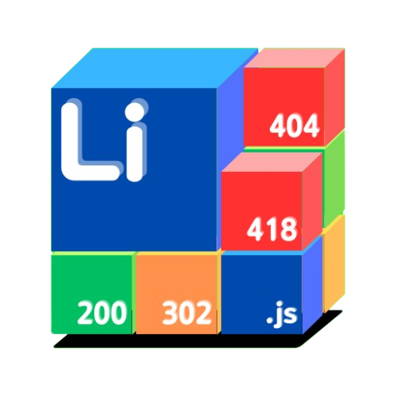

<div align="center">
    
    <h1>Liminal-NSP</h1>
    <p>Liminal Network/Node.js Service Platform</p>
    <sub>基於 Node.js 打造的網站框架服務。</sub>
</div>

<div align="center">

[English](readme_en.md) | 繁體中文


</div>

# 早期測試版本
這個專案還在早期測試版本，我們還需要一點時間的改進。

# Liminal-NSP
這是一個基於 Node.js 打造的網頁框架，其目的性是要最大化利用 Node.js 的非阻塞特性。<br>
其中 ``.mjs`` 動態檔案可以讓開發者不必過多的切換語言問題，只需要學會一個 Javascript 即可完成後端指令。

# 如何安裝 (開發階段)
1. 克隆本專案，或者下載至本機上。
2. 調整 ``Config``。
- - Linux 用戶須用 Terminal ``cd`` 到該資料夾中，並且調整 ``config`` 資料夾中的配置。
- - Windows 用戶進入該資料夾後，調整 ``config`` 資料夾中的配置。
3. 使用 ``npm install`` 指令。
4. 開啟伺服器，使用 ``npm run server``(單核心) 或者 ``npm run cluster``(多核心)。

# Config 配置
| 檔案 | 說明 |
|-----|-----|
| allowController.json | 直接通過允許清單，以專案資料夾為底，使用相對路徑即可 |
| basePath.json | 專案資料夾設置，絕對路徑 |
| errorPage.json | 控制錯誤頁面路徑，Key應該是404/500/501等，位子則是以專案資料夾為底，使用相對路徑即可 |
| headerFile.json | 標頭控制器，可以自定義回傳的標頭 |
| serverSettings.json | 基礎設定，包含Port、允許執行.mjs、啟用類型控制保護、除錯模式 |
| typeController.json | 類型控制器，每一個類型包函 只允許參考(referer)、只允許POST(POST)、允許跨站訪問(cross) |

# 關於mjs運行
直接用 fetch .mjs 的檔案即可<br>

``index.html``
```html
<html>
    <head>
        <script>
            fetch("./Hello.mjs");
        </script>
    </head>
    <body></body>
</html>
```

``Hello.mjs``
```js
import fs from "fs";

export async function main(req, send){
    if(req.method == "POST")
        send.message("You are using POST method.");
    else if(req.method == "GET")
        send.message("You are using GET method.");
    else
        send.code(500);

    send.end();
}
```

# 感謝
非常感謝 Node.js 的開發者<br>
還有我的大腦。