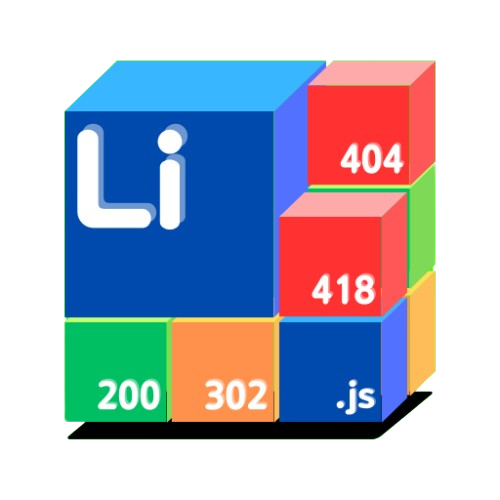

<div align="center">
    
    <h1>Liminal-NSP</h1>
    <p>Liminal Node.js Service Platform</p>
    <sub>A website framework service built with Node.js.</sub>
</div>

<div align="center">

English | [繁體中文](readme.md)


</div>

# Early Testing Version
This project is still in its early testing stage, and it will take some time for improvements.

# Liminal-NSP
This is a web framework built with Node.js, designed to maximize the use of Node.js’s non-blocking features.<br>
The ``.mjs`` dynamic files allow developers to avoid switching between multiple languages, requiring only JavaScript to complete backend logic.

# How to Install (Development Stage)
1. Clone this project or download it locally.
2. Adjust the ``Config`` folder.
- - Linux users: use Terminal and ``cd`` into the project folder, then adjust the configuration files inside the ``config`` directory.
- - Windows users: enter the project folder and adjust the configuration files inside the ``config`` directory.
3. Use command ``npm install``
4. Start the server using ``npm run server`` (single core) or ``npm run cluster`` (multi-core).

# Config
| File | Description |
|------|-------------|
| allowController.json | Whitelist configuration, relative to the project directory |
| basePath.json | Project folder path, absolute path |
| errorPage.json | Error page path control, keys should be 404/500/501 etc., values are relative to the project folder |
| headerFile.json | Header controller, allows custom response headers |
| serverSettings.json | Basic settings including Port, .mjs execution, type control protection, debug mode |
| typeController.json | Type controller, each type may include: only allow referer (referer), only allow POST (POST), allow cross-site access (cross) |

# About Running .mjs
Simply fetch the ``.mjs`` file directly<br>

``index.html``
```html
<html>
    <head>
        <script>
            fetch("./Hello.mjs");
        </script>
    </head>
    <body></body>
</html>
````

`Hello.mjs`

```js
import fs from "fs";

export async function main(req, send){
    if(req.method == "POST")
        send.message("You are using POST method.");
    else if(req.method == "GET")
        send.message("You are using GET method.");
    else
        send.code(500);

    send.end();
}
```

# Acknowledgments

Special thanks to the developers of Node.js<br>
And my brain.